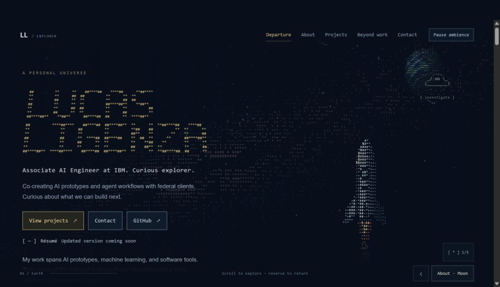

# ASCII Galaxy

A personal portfolio by **Lucas Ligenza**, explored as a journey through an ASCII galaxy. Native scrolling carries a rocket from Earth to the Moon, Mars, a ringed world, and beyond. Each stop reveals a different part of the portfolio, with small interactive discoveries along the way.

**[Explore the live site →](https://lucas-ligenza-portfolio.vercel.app/)**



## The experience

- **Scroll to fly.** Movement follows scroll position, stops when scrolling stops, and reverses along the same route.
- **Take a direct route.** Destination links jump to About, Projects, Beyond work, or Contact.
- **Explore the scenery.** Five interactive ASCII discoveries keep a small journal in browser storage.
- **Choose the motion.** Ambience can be paused independently. Reduced-motion preferences turn the journey into ordinary scrolling content with static scenery.

The rocket, planets, and galaxy are drawn with characters. Portfolio content and controls use HTML, so text remains selectable and navigation remains keyboard accessible.

## How it works

Built with **JavaScript, Canvas 2D, HTML, and CSS**, with a small Node.js build pipeline and no third-party runtime dependencies.

| Layer | Responsibility |
| --- | --- |
| Journey model | Maps document scroll position to reading zones, departure, cruise, and approach. Pure functions keep the route testable independently of the browser. |
| Navigation | Measures content, manages deep links and browser history, and keeps long sections readable within the document flow. |
| Renderer | Draws the ASCII scenery on a fixed canvas. An independent animation clock controls ambience and pauses when the page is hidden. |
| Discoveries | Manages interactive objects, local progress, and dialogs that restore the exact reading position when closed. |
| Build | Generates the character artwork and assembles the HTML, styles, and scripts into a self-contained static page. |

Flight distance is proportional to viewport height. Reading zones expand with their content, keeping the camera at a destination until the text has been revealed. This gives the journey a consistent structure across screen sizes without nested scrolling.

## Run locally

Requires **Node.js 24** and npm.

```sh
git clone https://github.com/lucasligenza/lucas-ligenza-portfolio.git
cd lucas-ligenza-portfolio
npm ci
npm run build
npm run preview
```

Open [localhost:4173](http://localhost:4173). Rebuild after changing source files, then refresh the preview.

| Command | Purpose |
| --- | --- |
| `npm test` | Run the automated checks. |
| `npm run build` | Run checks and generate the static site in `dist/`. |
| `npm run preview` | Serve the generated site locally. |

## Source map

```text
src/
  journey.html             Portfolio content
  journey-model.js         Scroll position and flight state
  journey-navigation.js    Navigation, history, and motion preferences
  journey-renderer.js      Canvas scenery
  journey-discoveries.js   Interactive discoveries
  journey.js               Project shortcuts and content measurement
  rocket.js                ASCII rocket artwork
  journey*.css             Layout and visual styles
scripts/                   Build, artwork generation, and local preview
tests/                     Journey, navigation, and build checks
public/                    Favicon and crawler directives
```

The tests cover forward and reverse travel, long reading zones, deep links, browser Back, pause and reduced-motion behavior, hidden-page suspension, dialog scroll restoration, and deterministic builds.
